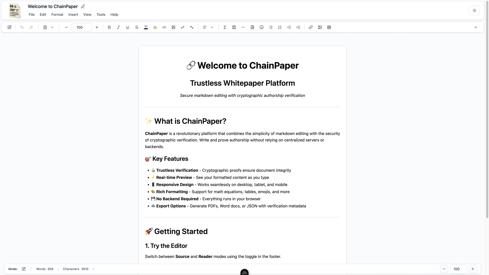

# ChainPaper - Trustless Whitepaper

✍️ Secure markdown platform for authorship assurance, built with Nuxt, Vue, TypeScript, shadcn/ui, Tailwind, KaTeX, and Markdown-it, featuring cryptographic SHA-256 verification.

## ☁️ Deploy your own

[](https://vercel.com/new/clone?repository-url=https://github.com/KurutoDenzeru/ChainPaper)  [](https://app.netlify.com/start/deploy?repository=https://github.com/KurutoDenzeru/ChainPaper)

## ✨ Features

- **Real-time Markdown Editing:** Live preview of markdown content as you type with instant rendering.
- **Authorship Verification:** Built-in cryptographic proofs to verify document contributors and maintain an immutable history.
- **Advanced Formatting:** Support for superscript, subscript, math expressions (KaTeX), tables, lists, and text alignment.
- **Rich Media Insertion:** Insert emojis, tables, horizontal lines, footnotes, and code blocks with customizable options.
- **Responsive Design:** Optimized for desktops, tablets, and mobile devices with adaptive layouts.
- **Export Options:** Generate documents with proper formatting and verification metadata.
- **Open Source:** Free to use and contribute to, built with modern web technologies.

## 🧱 Tech Stack

- [Nuxt.js](https://nuxt.com/): Vue framework for building performant full-stack applications.
- [Vue 3](https://vuejs.org/): Progressive JavaScript framework with Composition API.
- [TypeScript](https://www.typescriptlang.org/): Typed JavaScript for better development experience.
- [Shadcn Vue](https://www.shadcn-vue.com/): Re-usable components built using Radix Vue and Tailwind.
- [Tailwind CSS](https://tailwindcss.com/): Utility-first CSS framework for rapid UI development.
- [KaTeX](https://katex.org/): Fast math typesetting for rendering mathematical expressions.
- [Markdown-it](https://github.com/markdown-it/markdown-it): Flexible markdown parser with plugins.

## ⚡ Getting Started

Clone the repo, install deps, and boot the dev server:

```bash
git clone https://github.com/KurutoDenzeru/ChainPaper.git
cd ChainPaper
bun install
bun run dev
```

Open [http://localhost:3000](http://localhost:3000) to view the app.

## 📦 Build for Production

```bash
bun run build
bun start
```

## 🗂️ Configuration

The editor is componentized under `app/components`. Key areas to customize are:

```text
app/
	components/
		layout/
			EditorToolbar.vue  # Main editing toolbar
			MenuBar.vue        # Menu bar with formatting/insert options
			StickyFooter.vue   # Dock/status bar and controls
		dialogs/               # Dialog components (About, Export, etc)
	composables/               # Reusable logic (useDocument, useSeo, ...)
	lib/                       # Utility and formatting helpers
	pages/
		index.vue              # App entry page, composes layouts and editor
	stores/                    # Pinia stores (editorMode, markdownDoc)
public/
	OpenGraph.webp             # Social preview image
	robots.txt                 # Crawler rules
server/
	api/
		upload.post.ts         # File upload API route
types/                         # TypeScript type declarations
```

## 🤝🏻 Contributing

Contributions are always welcome, whether you’re fixing bugs, improving docs, or shipping new features that make the project better for everyone.

Check out [Contributing.md](Contributing) to learn how to get started and follow the recommended workflow.

<!-- Please adhere to this project's `Code of Conduct`. -->

## ⚖️ License

This project is released under the MIT License, giving you the freedom to use, modify, and distribute the code with minimal restrictions.

For the full legal text, see the [MIT](LICENSE) file.